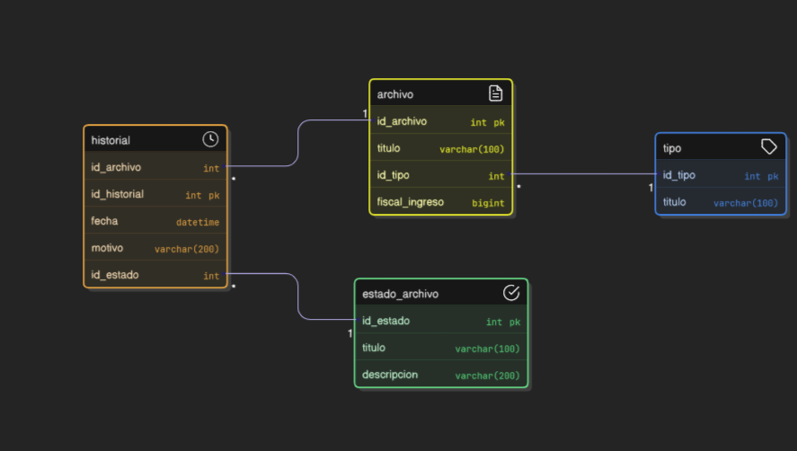

# Departamento de archivo BACKEND

## Paquetes utilizados
### cors
Habilita y configura CORS (Cross-Origin Resource Sharing) para permitir solicitudes entre dominios.

### dotenv
Carga variables de entorno desde un archivo .env al entorno de ejecución de Node.js.

### express
Framework web minimalista y flexible para crear APIs y aplicaciones en Node.js.

### morgan
Middleware de registro de solicitudes HTTP (logging) para desarrollo y debugging.

### msnodesqlv8
Driver nativo para conectar Node.js con Microsoft SQL Server usando autenticación de Windows (ODBC).

### mssql
Cliente para conectarse a bases de datos Microsoft SQL Server usando TDS (Tabular Data Stream).


## Requerimiento para ejecutar

archivo .env
```
DB_DATABASE=... 
DB_SERVER=...
PORT=...
```

comando para ejecutar
```
npm run dev
```

## Entidad Relacion

